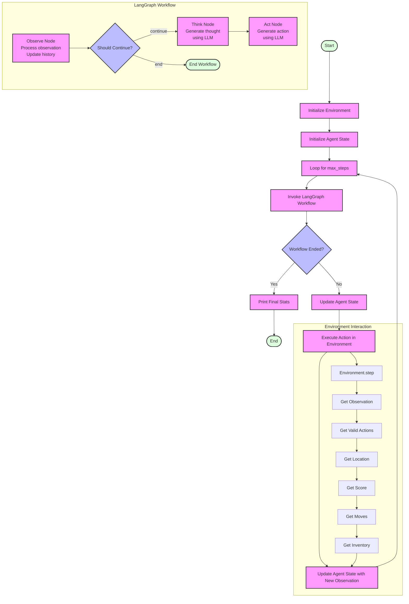

# Zork AI Agent Workflow

This document provides a visual representation and explanation of the Zork AI agent workflow.

## Workflow Diagram



## Explanation of the Workflow

The diagram illustrates the two-level control flow of our Zork AI agent:

### Outer Loop (Function Level)

1. **Initialization**: The process starts by initializing the environment and the agent state.
2. **Main Loop**: For each step (up to max_steps):
   - Invoke the LangGraph workflow
   - Check if the workflow has ended
   - Update the agent state with the result
   - Execute the action in the environment
   - Update the agent state with the new observation
3. **Termination**: Print final stats and end the process

### Inner Loop (LangGraph Workflow)

1. **Observe Node**: Process the current observation and update history
2. **Should Continue?**: Determine if the workflow should continue or end
3. **Think Node**: Generate a thought about the current state using the LLM
4. **Act Node**: Generate an action based on the thought using the LLM

### Environment Interaction

The diagram also shows how the agent interacts with the environment:
- Execute the action in the environment
- Get the observation, valid actions, location, score, moves, and inventory
- Update the agent state with the new information

## Implementation Details

### LangGraph Workflow Design

We implemented the LangGraph workflow with a linear flow (without loops) for technical reasons:

1. **Recursion Limit Issues**: When we initially implemented the workflow with a loop from "act" back to "observe", we encountered a `GraphRecursionError` with the message "Recursion limit of 25 reached without hitting a stop condition." This error occurs because LangGraph has built-in safeguards to prevent infinite loops.

2. **State Management Approach**: LangGraph uses a different approach to state management than what we initially expected. When a graph is compiled and invoked, LangGraph attempts to run the entire graph to completion, following all edges until it reaches an end state or hits the recursion limit.

3. **Manual Loop Control**: By removing the loop in the graph definition and instead manually managing the loop in our `run_agent_workflow` function, we gain more control over the execution flow and can avoid the recursion limit.

### Code Implementation

In our implementation:

```python
# The graph definition is linear (no loops)
workflow.add_edge("observe", "think")
workflow.add_edge("think", "act")

# The function implements the loop
for step in range(max_steps):
    # Run one step of the workflow
    result = app.invoke(agent_state)
    
    # Update the agent state
    agent_state = result
    
    # Execute the action in the environment
    state = environment.step(agent_state["action"])
    
    # Update the agent state with the new observation
    agent_state["observation"] = state["observation"]
    # ... other state updates ...
```

This pattern is common in LangGraph applications where you need more control over the execution flow than what's provided by the built-in graph execution model.

## Benefits of This Approach

1. **Simplicity**: The graph structure is simpler and easier to reason about
2. **Reliability**: We avoid hitting recursion limits and potential stack overflows
3. **Flexibility**: We can add custom logic between steps
4. **Observability**: It's easier to log and debug the execution flow
5. **Control**: We have explicit control over when to continue or stop the loop

This design pattern allows us to leverage the strengths of LangGraph for defining the agent's reasoning process while maintaining control over the overall execution flow.
