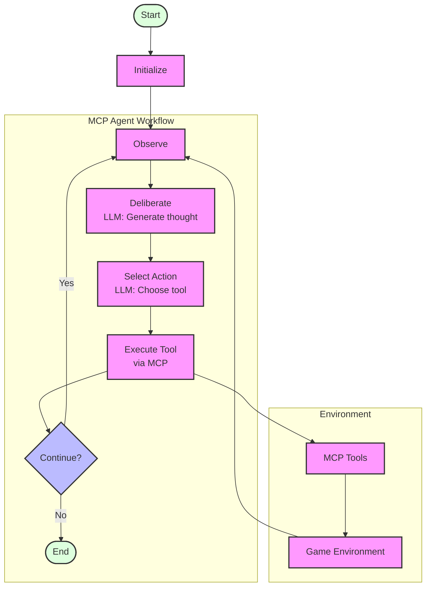

# Zork AI Agent: MCP Agent

This document provides a visual representation and explanation of the MCP agent workflow.

## Workflow Diagram



## Explanation of the Workflow

The diagram illustrates the MCP agent workflow, which uses a direct approach to interact with the environment through MCP tools:

### Main Loop

1. **Initialization**: The process starts by initializing the environment and the agent state.
2. **Main Loop**: For each step (up to max_steps):
   - Run the MCP agent workflow
   - Update the agent state with the result
   - Check if the game is done
3. **Termination**: Print final stats and end the process

### MCP Agent Workflow

The MCP agent follows a two-step process:

1. **Deliberation**: The agent first thinks about what to do next, considering the current game state, goals, and possible actions.
2. **Action Selection**: Based on this deliberation, the agent selects a specific action to take.

This approach mimics human problem-solving: we typically think before we act, weighing options and considering consequences.

In more detail:

1. **Process Observation**: The agent processes the current observation and updates its history
2. **Deliberate**: The agent generates a thought about what to do next using the LLM
3. **Select Action**: Based on the deliberation, the agent selects a specific MCP tool and parameters
4. **Execute Tool**: The agent executes the selected tool via MCP

### MCP Tool Execution

The diagram also shows how the agent interacts with the environment through MCP:
1. **MCP Client**: The agent sends a tool request to the MCP client
2. **MCP Server**: The client forwards the request to the MCP server
3. **Tool Registry**: The server looks up the requested tool in its registry
4. **Tool Execution**: The server executes the tool with the provided parameters
5. **Environment Interaction**: The tool interacts with the environment
6. **Tool Response**: The result is returned to the agent

## Usage

To run the MCP agent, use the `run_mcp_agent.py` script:

```bash
python src/run_mcp_agent.py
```

You can also use the unified runner:

```bash
python src/run_zork_agent.py --agent-type mcp
```

You can customize the agent's behavior with the following options:

- `--model`: The LLM model to use (default: "gpt-3.5-turbo")
- `--api-key`: The API key for the LLM provider (defaults to OPENAI_API_KEY env var)
- `--max-steps`: Maximum number of steps to run (default: 20)
- `--debug`: Print debug information

## Implementation

The agent is implemented in `agent.py` and consists of three main functions:

- `run_agent`: The main function that runs the agent loop
- `generate_thought`: Generates a deliberative thought about what to do next
- `select_action`: Selects an action to take based on the thought

The agent uses the MCP environment to interact with the Zork game.

## Comparison with Other Agents

- **LangGraph Agent**: Uses LangGraph but not MCP, generates text commands directly
- **MCP LangGraph Agent**: Uses both LangGraph and MCP, selects MCP tools and provides parameters
- **MCP Agent**: Uses MCP directly without LangGraph, follows a deliberative process
