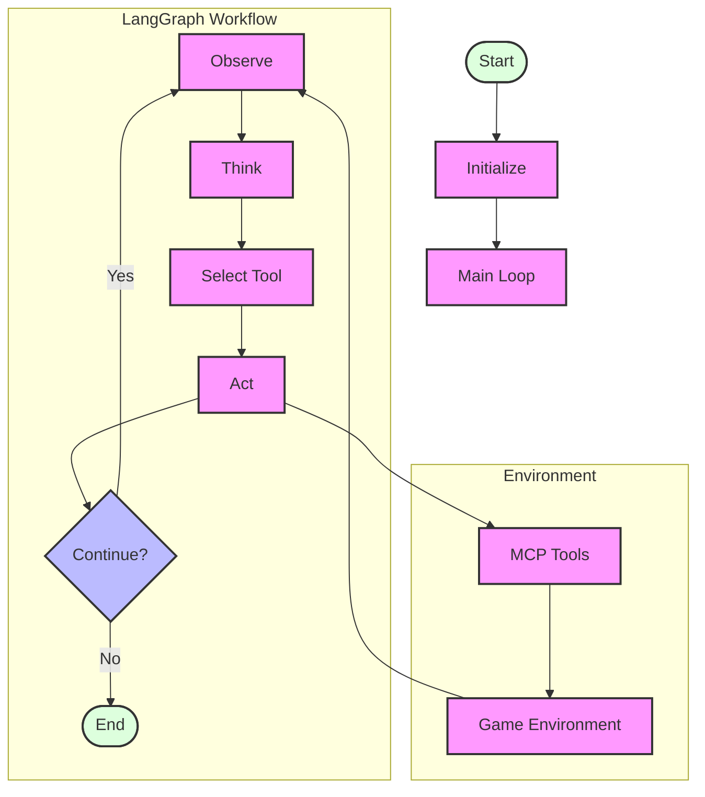

# Zork AI Agent: MCP LangGraph Workflow

This document provides a visual representation and explanation of the MCP LangGraph agent workflow.

## Workflow Diagram



## Explanation of the Workflow

The diagram illustrates the MCP LangGraph agent workflow, which extends the basic LangGraph architecture with a tool selection layer:

### Outer Loop (Function Level)

1. **Initialization**: The process starts by initializing the environment and the agent state.
2. **Main Loop**: For each step (up to max_steps):
   - Invoke the LangGraph workflow
   - Check if the workflow has ended
   - Update the agent state with the result
   - Execute the action in the environment
   - Update the agent state with the new observation
3. **Termination**: Print final stats and end the process

### Inner Loop (LangGraph Workflow)

1. **Observe Node**: Process the current observation and update history
2. **Should Continue?**: Determine if the workflow should continue or end
3. **Think Node**: Generate a thought about the current state using the LLM
4. **Select Tool Node**: Choose a tool and parameters based on the thought
5. **Act Node**: Execute the selected tool via MCP

### MCP Tool Execution

The diagram also shows how the agent interacts with the environment through MCP:
1. **MCP Client**: The agent sends a tool request to the MCP client
2. **MCP Server**: The client forwards the request to the MCP server
3. **Tool Registry**: The server looks up the requested tool in its registry
4. **Tool Execution**: The server executes the tool with the provided parameters
5. **Environment Interaction**: The tool interacts with the environment
6. **Tool Response**: The result is returned to the agent

## Implementation Details

### Tool Selection Process

The MCP LangGraph agent adds a tool selection node to the workflow, which:

1. **Receives the agent's thought** about what to do next
2. **Presents available tools** with descriptions and parameter schemas
3. **Selects the most appropriate tool** based on the current situation
4. **Provides structured parameters** for the selected tool

Example tool selection prompt:
```
You are an expert text adventure game player. You are playing Zork.

Current Observation:
You are standing in an open field west of a white house, with a boarded front door.
There is a small mailbox here.

Current Location:
west_of_house

Inventory:
[]

Your Thought:
I should examine the mailbox to see if there's anything inside.

Available Tools:
- navigate: Move in a specified direction (north, south, east, west, up, down)
- examine: Examine an object in the environment
- take: Take an object
- drop: Drop an object from your inventory
- inventory: Check your inventory
- read: Read an object with text
- look: Look around to get a description of your surroundings

Select the most appropriate tool and provide its parameters in JSON format.
```

Example tool selection response:
```json
{
  "tool": "examine",
  "args": {
    "object": "mailbox"
  }
}
```

### MCP Integration

The MCP LangGraph agent uses the Model Context Protocol (MCP) by default to interact with tools:

1. **Tool Definition**: Tools are defined in the MCP server with schemas
2. **Tool Registration**: Tools are registered with the MCP server at startup
3. **Tool Execution**: The agent requests tool execution via MCP
4. **Result Processing**: The agent processes the tool execution result

This approach provides several advantages:
- **Standardization**: Tools follow a consistent interface
- **Extensibility**: New tools can be added without modifying the agent
- **Separation of Concerns**: Tool implementation is separate from agent logic
- **Direct Tool Access**: The agent directly accesses tools through the MCP server rather than translating to text commands

### Code Implementation

In our implementation:

```python
# The graph definition includes a tool selection node
workflow.add_edge("observe", "think")
workflow.add_edge("think", "select_tool")
workflow.add_edge("select_tool", "act")

# The select_tool node chooses a tool and parameters
def select_tool(state: AgentState) -> AgentState:
    # Create a prompt for the LLM
    prompt = f"""
    You are an expert text adventure game player. You are playing Zork.
    
    Current Observation:
    {state["observation"]}
    
    Current Location:
    {state["location"]}
    
    Inventory:
    {state["inventory"]}
    
    Your Thought:
    {state["thought"]}
    
    Available Tools:
    - navigate: Move in a specified direction (north, south, east, west, up, down)
    - examine: Examine an object in the environment
    - take: Take an object
    - drop: Drop an object from your inventory
    - inventory: Check your inventory
    - read: Read an object with text
    - look: Look around to get a description of your surroundings
    
    Select the most appropriate tool and provide its parameters in JSON format.
    """
    
    # Generate a tool selection using the LLM
    response = llm.invoke(prompt)
    
    # Parse the tool selection
    tool_selection = json.loads(response.content)
    
    # Update the state with the selected tool
    state["tool_name"] = tool_selection["tool"]
    state["tool_args"] = tool_selection["args"]
    
    return state

# The act node executes the selected tool
def act(state: AgentState) -> AgentState:
    # Get the selected tool and arguments
    tool_name = state["tool_name"]
    tool_args = state["tool_args"]
    
    # Check if we can use MCP tools directly
    if hasattr(environment, 'server_name') and HAS_MCP:
        # Execute the tool via MCP
        result = use_mcp_tool(environment.server_name, tool_name, tool_args)
    else:
        # Fall back to the mock environment if MCP is not available
        result = environment.step(action_string)
    
    # Update the state with the action result
    state["action"] = f"{tool_name}({tool_args})"
    state["tool_result"] = result
    
    return state
```

## Benefits of the MCP LangGraph Approach

1. **Structured Interaction**: Tools provide a structured interface to the environment
2. **Clear Reasoning**: The agent explicitly reasons about which tool to use
3. **Extensibility**: New tools can be added without modifying the agent
4. **Modularity**: Tool implementation is separate from agent logic
5. **Alignment**: This approach aligns with modern AI agent frameworks

This design pattern represents the evolution of AI agents from direct command generation to explicit tool use, which is the dominant paradigm in modern AI agent frameworks.
